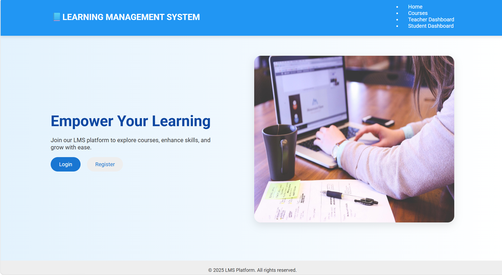
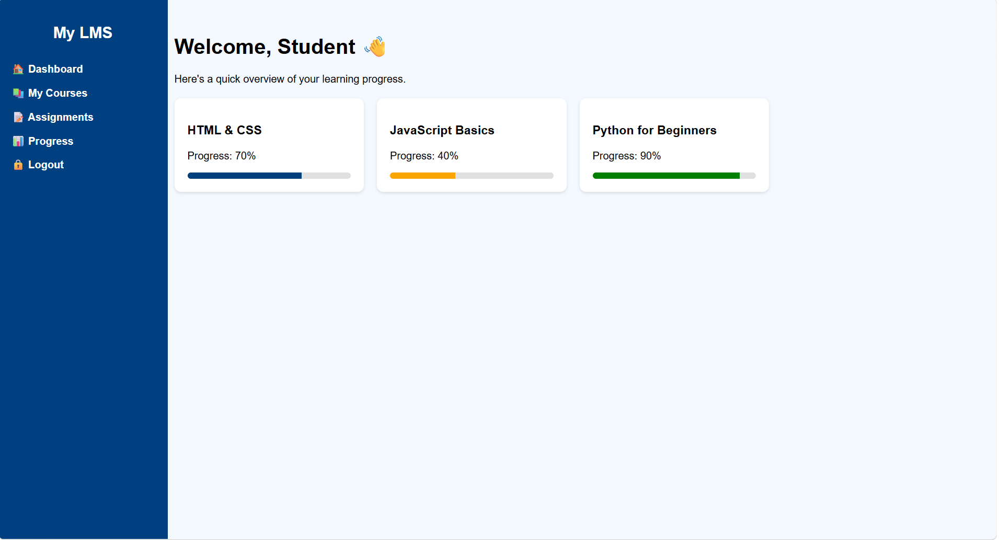
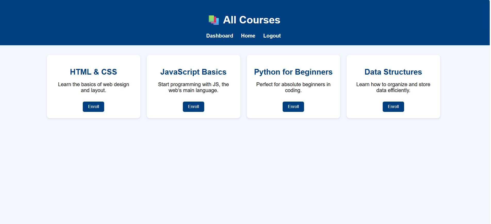
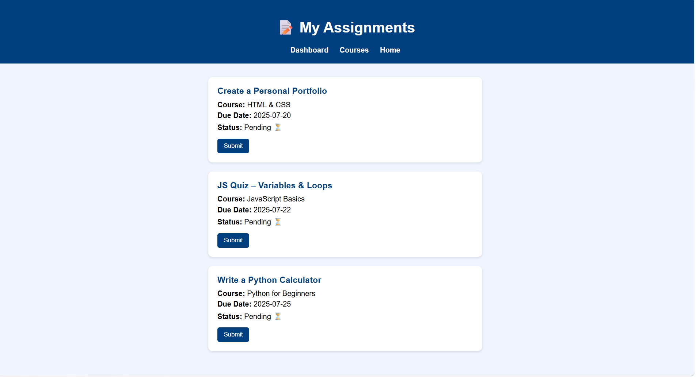
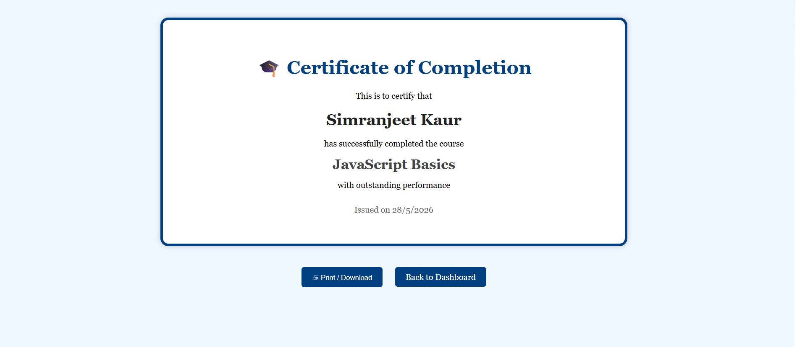
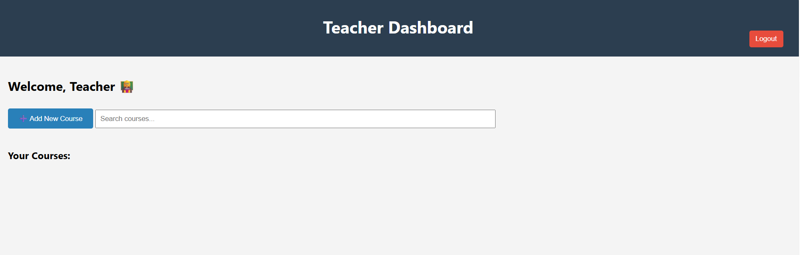
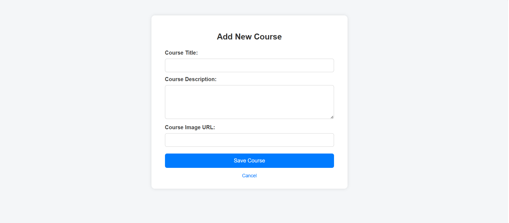

# Learning Management System (LMS) 🎓

A Full Stack Learning Management System built for students and teachers with authentication, course management, and interactive dashboard features.

## 🚀 Features

- Student & Teacher Login
- Authentication System
- Role-Based Access
- Course Management
- Add Courses
- Explore Courses
- Dashboard Interface
- Responsive UI

## 🛠️ Tech Stack

- HTML
- CSS
- JavaScript
- React.js
- Node.js
- Express.js
- MongoDB

## 📂 Project Structure

- Frontend
- Backend
- Authentication
- Dashboard
- Course Modules

## ▶️ How to Run

### Frontend
```bash
npm start
```

### Backend
```bash
npm run server
```

## 📸 Project Screenshots

### Login Page


### Student Dashboard


### Explore Courses


### Assignment section


### Progress Reward


### Teacher Panel


### Add Courses


## 🌟 Future Improvements

- Video Lectures
- Payment Integration
- Live Classes
- Certificate Generation